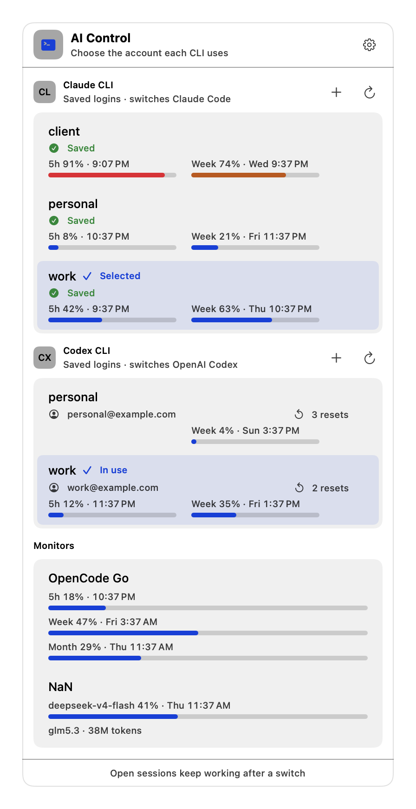
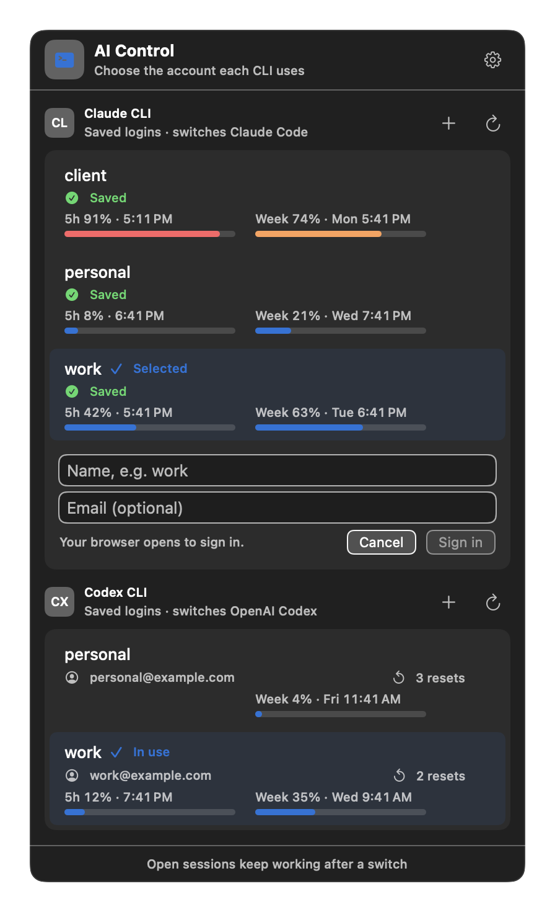

<h1 align="center">AI Control</h1>

<p align="center">
  <strong>Switch between your Claude Code and Codex CLI accounts with one click — no signing in again.</strong>
</p>

<p align="center">
  <picture>
    <source media="(prefers-color-scheme: dark)" srcset="docs/images/menu-dark.png">
    
  </picture>
</p>

AI Control is a small macOS menu-bar app, with a terminal UI for Linux. It keeps
a saved copy of each account's login, swaps the live login when you pick another
account, and shows how much of each account's usage limits is left. Logins never
leave your computer: on macOS they are kept in your login Keychain, on Linux in
files only your user can read, and they are never sent anywhere.

> **Unofficial.** AI Control is not affiliated with or endorsed by Anthropic or
> OpenAI. It only works with accounts you own. Use it according to each
> provider's terms.

## Features

- **One-click switching** for Claude Code and the Codex CLI, without signing in again.
- **Open sessions keep working** after a switch.
- **Usage at a glance**: 5-hour and weekly limits for every account, with reset
  times, plus the rate-limit resets Codex has left.
- **Add and rename accounts** from the menu; signing in opens your browser.
- **Nothing to maintain**: saved logins of accounts you are not using are renewed
  automatically by the official CLIs when needed.
- **Safe by design**: every switch is checked first and stops before writing
  anything if the result could be uncertain.

## Requirements

- macOS 13 or later on Apple silicon, or Linux (Debian 12+, Ubuntu 22.04+, Arch)
  on x86_64 or arm64
- Claude Code installed with the native installer (`~/.local/bin/claude`)
- Codex CLI signed in with ChatGPT

You can use AI Control with only one of the two CLIs.

## Install

### Download the app (recommended)

1. Download `AI-Control-<version>.zip` from the
   [latest release](https://github.com/Gefermanpernia/ai-control/releases/latest).
2. Unzip it and drag **AI Control** into your **Applications** folder.
3. The first time, **right-click AI Control and choose Open**, then **Open** again.
   AI Control is not signed by Apple, so macOS asks once before running it.
   If macOS still refuses, run
   `xattr -dr com.apple.quarantine "/Applications/AI Control.app"` and open it again.
4. *Optional:* to use the `aic` terminal command, run

   ```sh
   mkdir -p ~/.local/bin
   ln -s "/Applications/AI Control.app/Contents/Resources/aic" ~/.local/bin/aic
   ```

To start AI Control when you log in, add it in **System Settings → General →
Login Items**. To update, quit AI Control (⚙ → **Quit AI Control**) and replace
the app with the one from the newest release.

### Build from source

Requires Swift 5.7 or later.

**1. Install Apple's developer tools** (skip this if you already have Xcode):

```sh
xcode-select --install
```

**2. Download and build AI Control** (the first build takes about a minute):

```sh
git clone https://github.com/Gefermanpernia/ai-control.git
cd ai-control
swift build
```

**3. Add the `aic` command:**

```sh
mkdir -p ~/.local/bin
ln -s "$PWD/scripts/aic" ~/.local/bin/aic
```

The Claude Code installer normally puts `~/.local/bin` on your `PATH`. If `aic`
is not found, add this line to `~/.zshrc` and open a new terminal:

```sh
export PATH="$HOME/.local/bin:$PATH"
```

**4. Start it** with `aic`, then follow [Getting started](#getting-started).

To update a source build, run `git pull` and `swift build`, then restart AI
Control: ⚙ → **Quit AI Control**, then `aic`.

### Linux

Download the package for your system from the
[latest release](https://github.com/Gefermanpernia/ai-control/releases/latest)
(`amd64`/`x86_64` for Intel and AMD, `arm64`/`aarch64` for ARM).

**Debian and Ubuntu:**

```sh
sudo apt install ./ai-control_<version>_amd64.deb
```

**Arch:** download `PKGBUILD` from the release into an empty folder, then

```sh
makepkg -si
```

Both install `aic` and `aic-tui`; Swift and Rust are not needed. Run `aic` to
open the terminal UI:

| Key | What it does |
|---|---|
| ↑ ↓ or `j` `k` | Choose an account |
| `Tab` | Move between Claude and Codex |
| `Enter` | Switch to the chosen account (asks first) |
| `a` | Add an account (signing in opens your browser) |
| `n` | Rename the chosen account |
| `r` | Reload usage |
| `q` | Quit |

Usage is loaded when the UI opens and when you press `r`, never in the
background.

### Uninstall

Removing AI Control leaves your CLIs signed in to their current accounts. Quit
AI Control (⚙ → **Quit AI Control**), then remove it together with the logins it
saved:

```sh
rm ~/.local/bin/aic
security delete-generic-password -s AIControl-claude-logins.v2
security delete-generic-password -s AIControl-codex-logins.v1
rm -r ~/Library/Application\ Support/AIControl
```

Finally delete **AI Control** from Applications, or the `ai-control` folder if
you built it from source.

On Linux, remove the package (`sudo apt remove ai-control` or
`sudo pacman -R ai-control`), then the saved logins:

```sh
rm -r ~/.local/share/ai-control
```

## Getting started

### 1. Open the menu

Open **AI Control** from Applications (or run `aic`). Its icon appears in the
menu bar; click it to open the menu.

### 2. Add your accounts

Click **+** next to *Claude CLI* or *Codex CLI*, type a short name such as `work`
(and, for Claude, optionally the account's email), then click **Sign in**. Your
browser opens: sign in with that account and come back — it appears in the list.

<p align="center">
  
</p>

Repeat for each account. If a CLI is already signed in to an account you want to
keep, you can save it as it is with `aic save work` (Claude) or
`aic codex save work` (Codex).

### 3. Switch

Click an account. Claude marks the chosen account **Selected**; Codex marks the
account it is using **In use**. Your open sessions keep working; new requests use
the account you picked.

### 4. Check usage and manage accounts

- **Usage** is loaded every time you open the menu, and with the ↻ button.
- **Rename** an account by right-clicking it and choosing **Rename…**.

macOS may ask for permission the first time AI Control uses the Keychain; choose
**Always Allow**.

## Command line

Everything in the menu is also available from the terminal:

| Command | What it does |
|---|---|
| `aic` | Open the menu-bar app (macOS) or the terminal UI (Linux) |
| `aic tui` | Open the terminal UI |
| `aic login <name> [email]` | Sign in to another Claude account and save it |
| `aic save <name>` | Save the Claude account that is signed in now |
| `aic use <name>` | Switch Claude Code to a saved account |
| `aic list` / `aic rename <old> <new>` | List or rename saved Claude accounts |
| `aic codex login <name>` | Sign in to another Codex account and save it |
| `aic codex save`, `use`, `list`, `rename` | The same for Codex |
| `aic usage` | Usage of every saved account |
| `aic renew <name>` / `aic codex renew <name>` | Renew a saved account's login now |
| `aic recover` | Finish or undo an interrupted Claude switch |
| `aic status --json [--usage]` | Saved accounts, and optionally their usage, as JSON for scripts |

Names use lowercase letters, digits, `-` and `_`, starting with a letter.

## Two rules that keep saved logins valid

1. **Never log out** with `/logout`, `claude auth logout` or `codex logout`.
   Logging out revokes the login, and its saved copy stops working.
2. **Add Codex accounts through AI Control** (the **+** button or
   `aic codex login`), not with `codex login` directly. Codex revokes the login it
   replaces; AI Control saves it and moves it aside first.

## How it works

**Claude Code** keeps its login in the Keychain item `Claude Code-credentials`
and the account profile in `~/.claude.json`. A switch:

- re-saves the outgoing login first, because Claude refreshes tokens in place;
- writes the target login through `/usr/bin/security`, the same tool Claude uses,
  so the item's access list never changes;
- replaces only the account-owned keys in `~/.claude.json` and leaves every other
  setting untouched;
- records each step in a journal, so an interrupted switch can be undone with
  `aic recover`.

Before touching anything, AI Control checks that the installed Claude Code stores
its login the way reviewed builds do, and refuses configuration overrides,
alternate authentication and legacy credential files.

**Codex CLI** keeps everything in `~/.codex/auth.json`. A switch re-saves the
outgoing login (Codex rotates refresh tokens), then replaces the file in one
atomic rename, only if Codex has not changed it meanwhile. Each saved login is
matched to its account from the file itself, so a login can never be saved under
the wrong name.

**Usage** comes from the same endpoints the CLIs use. The live account uses its
live login; other accounts use their saved login. A saved login whose access has
expired is renewed by the official CLI itself in a throwaway directory — a
temporary `CLAUDE_CONFIG_DIR` (with its own Keychain item) or `CODEX_HOME` —
with one tiny request, and the rotated login is saved before the directory is
removed. Your live login and settings are never touched.

Anything uncertain — an unknown build, an unsaved live login, a concurrent
change — stops the switch before it writes anything.

## Limitations

- Not signed by Apple, so macOS asks for confirmation the first time it opens.
- On Linux there is no tray icon yet; use `aic` or the terminal UI.
- Claude Code must come from the native installer; other installs are refused.
- When a Claude Code update changes how logins are stored, switching stops until
  the new build is reviewed.
- Codex logins stored in the Keychain instead of `auth.json` are not supported.

## Development

```sh
./scripts/test                          # full test suite
./scripts/test --filter CodexLoginTests # one suite
.build/debug/AIControl render-screenshots docs/images   # regenerate README images
./scripts/package-app 0.1.0             # build dist/AI-Control-0.1.0.zip
```

Releases are automatic. Commit messages follow
[Conventional Commits](https://www.conventionalcommits.org): `feat:` starts the
next minor version, `fix:` the next patch. On every push to `main`,
[release-please](https://github.com/googleapis/release-please) keeps a
"release x.y.z" pull request with the changelog up to date; merging it publishes
the release, and GitHub Actions attaches the tested, packaged app.

Tests use synthetic logins and temporary directories; they never read real
credentials. The README images are drawn from built-in example accounts, never
from real ones. Design notes and specifications live in `openspec/`.

## License

MIT. See [LICENSE](LICENSE).
